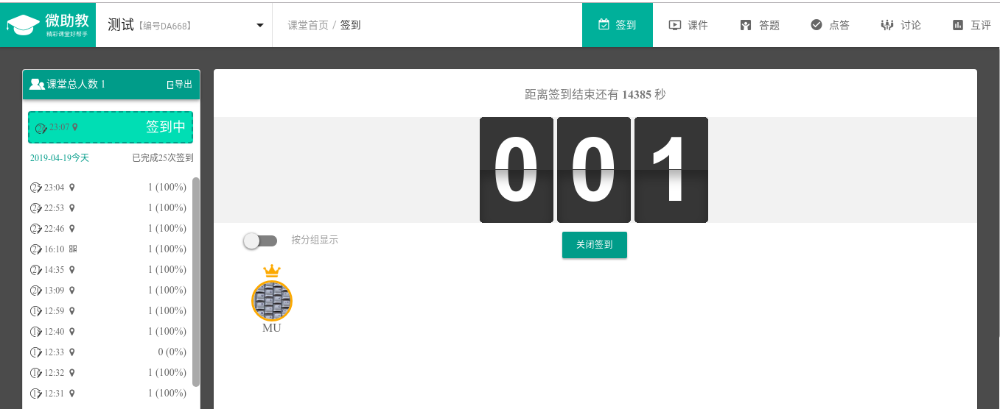
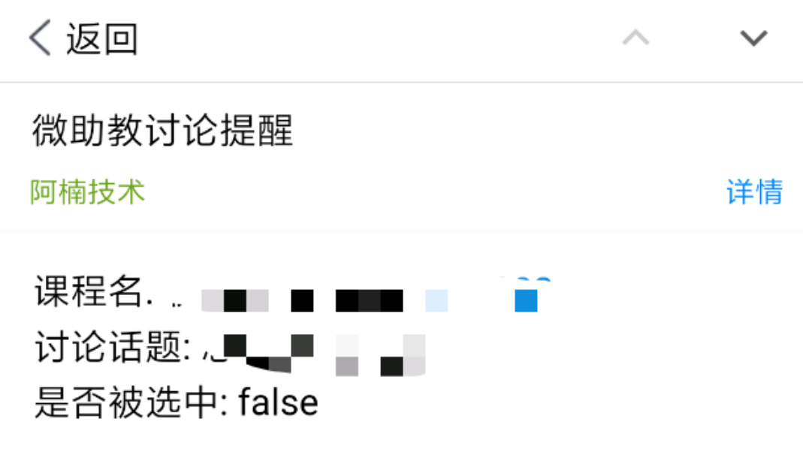
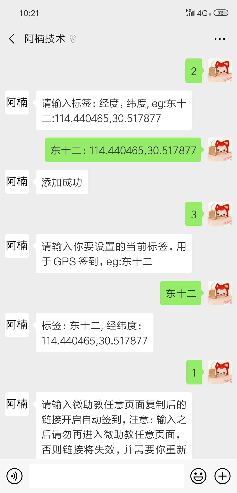
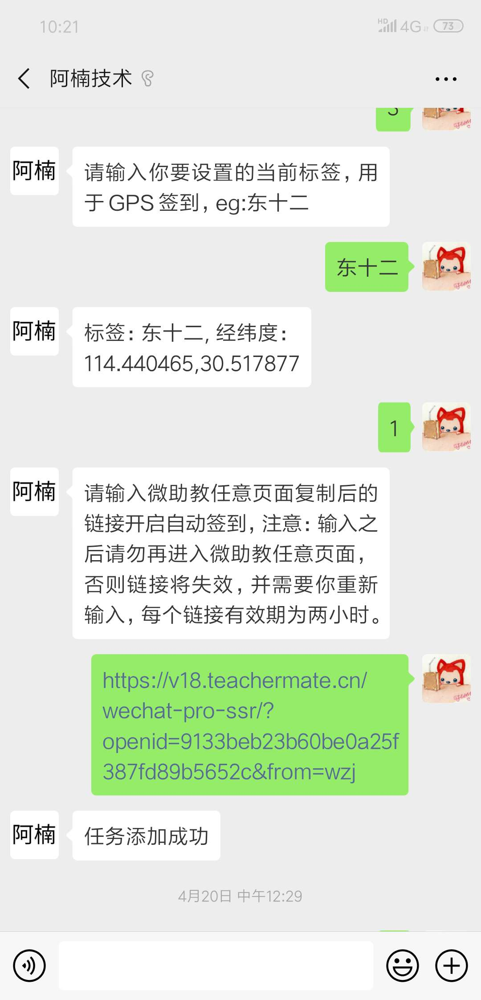
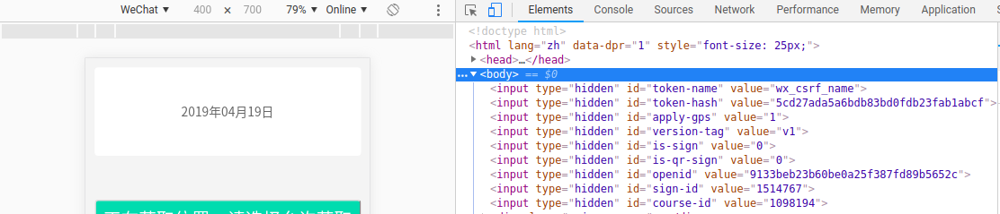

新版微助教自动签到

开发环境：

- 语言：Golang:1.11.3
- 借助展现平台：微信公众号

## 功能

- 多用户自动签到（二维码签到，GPS签到，普通签到均可）
  - 签到成功提醒
- 支持自定义坐标，如：114.440465,30.517877
- 支持自定义坐标标签，如：东十二
- 输入一次openid或者含有openid的链接之后，两小时内可自动签到所有签到
- 获取自己设置的所有标签和坐标
- 课程讨论开启邮件提醒
- 获取所有课程
- 设置讨论课程，注：设置之后仍然需要到微助教服务号参与讨论，考虑到在微助教那边设置讨论课程会更新openid，这里开发一个设置接口
- 设置通知邮件

注：

坐标拾取：https://lbs.amap.com/console/show/picker

坐标处理：签到时会对坐标进行随机化处理和截断处理，防止坐标惊人的一致

常用经纬度

- 东十二:114.440465,30.517877
  - F楼:114.440799,30.517263
- 东九
  - A区:114.433653,30.519743
  - B区:114.433165,30.519453
  - C区:114.432995,30.519014
  - D区:114.433286,30.518387
- 西十二
  - 北门:114.413702,30.514882
  - 南门:114.413811,30.514386
  - 东门:114.414505,30.514723
  - 西门:114.413069,30.514554

效果如下：






## 使用

关注公众号：阿楠技术


使用说明：

四种状态：

- 0 -> 默认状态
  - 输入0也会将状态重置
- 1 -> 设置为输入链接状态
  - 输入1之后直接输入微助教任意页面复制后的链接（带openid）
  - 或者直接输入openid
  - 注：此openid仅有两小时有效时间，因此每次上课前复制一次在公众号输入即可，每次进入微助教网页openid均会更新，如果重新进入了微助教页面，请更新openid
- 2 -> 设置为输入坐标状态
  - 输入格式如下：`东十二:114.440465,30.517877` ，左侧为标签，右侧为经纬度
- 3 -> 设置当前坐标标签状态
  - 输入格式如下：`东十二`
  - 设置之后之后所有的签到将使用此标签代表的坐标进行签到
- 4 -> 获取设置的所有标签和坐标
- 5 -> 获取所有讨论课程
- 6 -> 设置讨论课程,格式如下:课程id,课程名, eg: 1097665,测试
- 7 -> 设置通知邮件

示例如下：





## 原理

签到原理：

- 通过拉取https://v18.teachermate.cn/wechat/wechat/guide/signin?openid=$openid 页面，如下：

  

- 注意上图中hidden的input组件，其中包含了所需签到的所有信息，如：签到id：sign-id，课程id：course-id, 临时openid: openid

- 利用HTML分析包，提取出其中信息，若没有相关信息则暂停此次签到

- 使用接口：https://v18.teachermate.cn/wechat-api/v1/class-attendance/student-sign-in 进行签到

  form data: 

  ```json
  {
      "openid":"6d10c8781d8b1dc19120915880bce8a1",
  	"lon":114.440465,
  	"lat":30.517877,
  	"courseId":1098194,
  	"signId":1514058,
  	"wx_csrf_name":"5cd27ada5a6bdb83bd0fdb23fab1abcf"
  }

  ```

  Header:

  ```json
  {
  	"User-Agent":"Mozilla/5.0 (iPhone; CPU iPhone OS 8_4 like Mac OS X) AppleWebKit/600.1.4 (KHTML, like Gecko) Mobile/12H143 MicroMessenger/6.2.3 NetType/WIFI Language/zh_CN",
  	"Content-Type":"application/x-www-form-urlencoded; charset=UTF-8"
  }

  ```

公众号自动签到原理：

- 设置一个定时器，如：every 5s, 定时检测队列中是否存在监控对象
- 取出队列中监控的对象，监控对象可存储openid（微助教openid）
- 对象监控自动过期删除（两小时）
- 遍历监控对象进行签到（签到时会对坐标进行随机化处理和截断处理，防止坐标惊人的一致）


## 注意

- 本项目仅供学习和个人使用
- 侵删